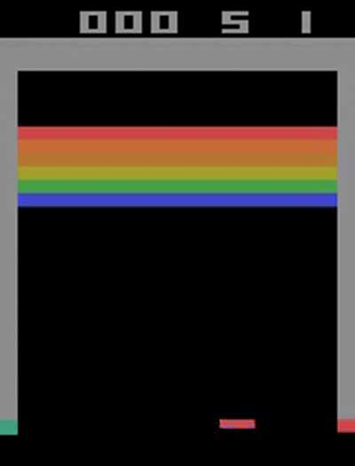
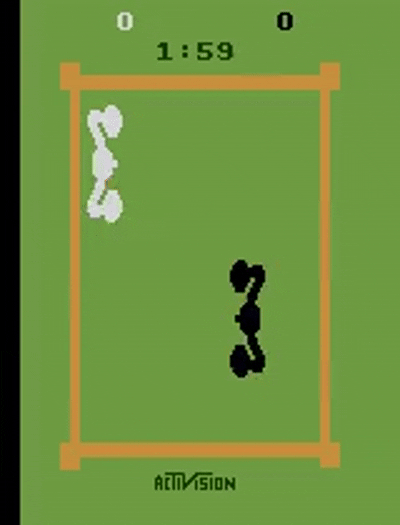
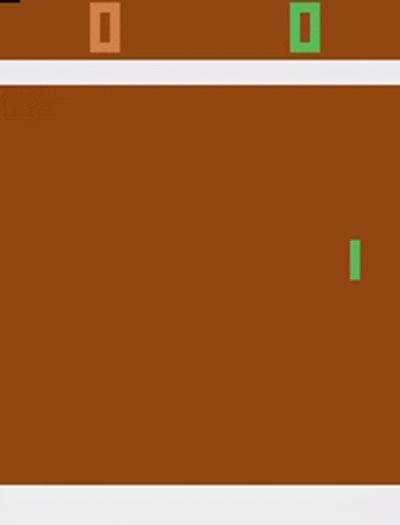

<!-- 
 -->

This repo is currently unstable except for dqn. However, it is continuously being updated.

<table>
  <tr>
    <td align="center"> Alien</td>
    <td align="center"> Breakout</td>
    <td align="center"> Boxing</td>
  </tr>
</table>

<table>
  <tr>
    <td align="center"> Enduro</td>
    <td align="center"> Pong</td>
  </tr>
</table>

# RL-code

A simple implementation of **Deep Reinforcement Learning Algorithms** using **OpenAI Gym**.

